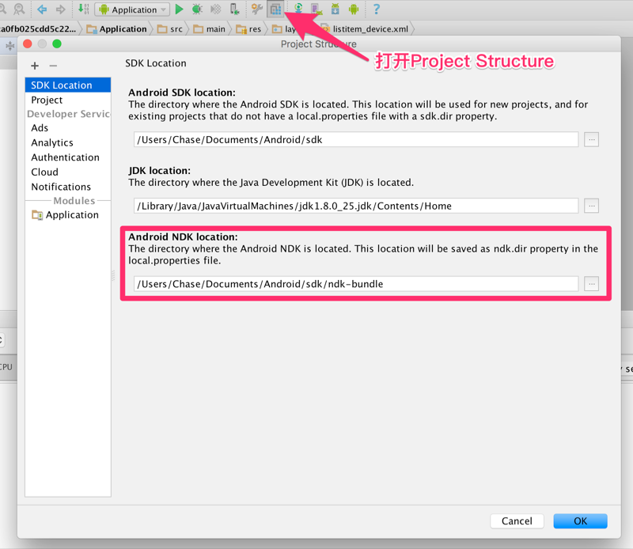

AndroidStudio调用C＋＋库
===
在深入Android学习了JNI的原理，现在来实践一下在Android Studio中调用C++库。
## 1 新建一个工程:  
创建一个空的工程。  
## 2 配置ndk路径:  
打开Project Structure，ndk不存在时会提示下载；
  

## 3 Modify app/build.gradle，在defaultConfig节点下增加：  
```
ndk {
    moduleName "MyJniLibName"
    abiFilters "armeabi", "armeabi-v7a", "x86"
}
```
gradle.properties  
```
android.useDeprecatedNdk=true
```

## 4 用javah生成.h头文件
```
javah -jni com.example.yuchaoqun.helloworldjni.JNIuseUtil
```
生成名为com_example_yuchaoqun_helloworldjni_JNIuseUtil.h的头文件

## 5 创建.c源文件
app/src/main/jni
创建同名的.c文件，并将.h文件移至当前目录下；
```
/* DO NOT EDIT THIS FILE - it is machine generated */
#include <jni.h>
/* Header for class com_miser_androidusejni_AndroidJniUtils */

#ifndef _Included_com_example_yuchaoqun_helloworldjni_JNIuseUtil
#define _Included_com_example_yuchaoqun_helloworldjni_JNIuseUtil
#ifdef __cplusplus
extern "C" {
#endif
/*
 * Class:     Java_com_example_yuchaoqun_helloworldjni_JNIuseUtil
 * Method:    getStringFromC
 * Signature: (II)Ljava/lang/String;
 */
JNIEXPORT jstring JNICALL Java_com_example_yuchaoqun_helloworldjni_JNIuseUtil_getStringFromC
        (JNIEnv *env, jclass jclass1, jint a, jint b) {
    return (*env)->NewStringUTF(env, "欢迎光临我的博客："
            "\nhttp://blog.yuchaoqun.net/"
           );
};

#ifdef __cplusplus
}
#endif
#endif

```

## 6 MainActivity中调用c代码
```
public class MainActivity extends AppCompatActivity {

    private static final String ACTIVITY_TAG = "LogDemo";

    @Override
    protected void onCreate(Bundle savedInstanceState) {
        super.onCreate(savedInstanceState);
        setContentView(R.layout.activity_main);

        Log.d(ACTIVITY_TAG, JNIuseUtil.getStringFromC());

    }
}
```

## 7 编译运行
可以在android monitor中看到打印；
